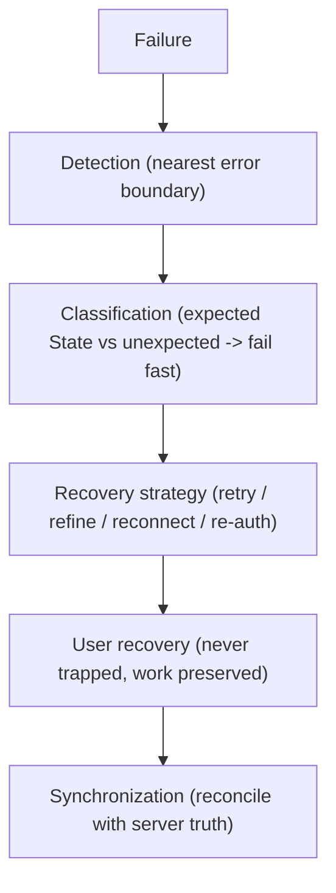

# AlphaScribe vNext — Error Boundary & Recovery Architecture

| Field | Value |
|-------|-------|
| **Document Status** | ✅ Approved in Principle (CTO) — Refinement Pass Applied |
| **Version** | 0.1.1 |
| **Owner** | Frontend Architecture |
| **Approved By** | CTO — approved in principle |
| **Department / Milestone** | Frontend Architecture · M3 — Data & State Architecture |
| **Governed by** | [Constitution](01_Frontend_Architecture_Constitution.md) · [03 Data & State](03_Data_and_State_Architecture.md) |
| **Last Updated** | 2026-07-19 |

## Revision History

| Version | Date | Author | Status | Description |
|---------|------|--------|--------|-------------|
| 0.1.0 | 2026-07-19 | Frontend Architecture | Draft (approved in principle) | Initial Milestone 3 document. |
| 0.1.1 | 2026-07-19 | Frontend Architecture | Refinement pass | CTO refinement pass: metadata standardized; documents 03.12–03.15 and architecture sequence diagrams added to the Milestone 3 package. No approved architectural decision changed. |

## Purpose

Define the **resilience architecture**: how errors are contained, how expected failure States are handled
gracefully, how unexpected failures fail fast without losing work, and how the user always recovers. This
operationalizes Fail Fast (§4.13), never-lose-work (Law 6), and the frozen recovery philosophy at the data
and boundary level.

## Scope

**In scope:** error boundary placement, expected-vs-unexpected failure handling, recovery flows, never-lose-
work under failure, AI/streaming failure, observability of errors. **Out of scope:** the frozen States
definitions (referenced), implementation, backend error generation.

## Dependencies

[Constitution](01_Frontend_Architecture_Constitution.md) §4.13 (Fail Fast), §4.15 (Observability), §6.3
(never-lose-work); [02.3 Routing](02.3_Routing_Architecture.md), [02.4 Layout](02.4_Layout_Architecture.md)
(boundaries), [02.6 UI Layer](02.6_UI_Layer_Architecture.md); [03.3 API Layer](03.3_API_Layer_Architecture.md)
(error normalization), [03.2 Server State](03.2_Server_State_Strategy.md), [03.5 Caching](03.5_Caching_Strategy.md);
frozen [States](../design/13_States.md), Design Constitution §20 (Error/Empty/Success) + Law 13 (every state
offers a way forward), [User Journeys](../design/02_User_Journeys.md) J-06.

## Architectural Decisions

### AD-1 — Layered error boundaries scope every failure
Error boundaries are placed along the layout/route hierarchy so a failure is **contained to the smallest
region** and never takes down the app ([02.4](02.4_Layout_Architecture.md), [02.3](02.3_Routing_Architecture.md)):
```
Root boundary        catches anything unhandled; app never white-screens
  Template boundary   scopes failure to a shell/section
    Route/segment     scopes failure to a destination; navigation stays available
      Feature/region  scopes failure to a component/region (e.g. one failed metric card)
```
Navigation and global chrome remain available at every level (frozen Navigation States).

### AD-2 — Expected failures are graceful frozen States; unexpected failures fail fast
Two distinct paths (§4.13):
- **Expected conditions** — the frozen [States](../design/13_States.md): Loading, Skeleton, Empty, No
  Results, **Offline**, **Permission Denied**, **Authentication Required**, **Error**, **Partial Failure**,
  **Timeout**, Success. These are **first-class, designed, accessible, recoverable** UI — handled calmly,
  never as crashes.
- **Unexpected conditions** — invalid data, contract violations, programming errors: **fail fast** —
  contained by the nearest boundary, surfaced with a clear, diagnostic error (not a silent swallow), work
  preserved, and reported to observability (§4.15). Never rendered as if valid (protects trust-critical data).

### AD-3 — Errors are normalized once, then rendered as States
Transport/protocol/domain failures are **normalized at the integration layer** ([03.3 AD-3](03.3_API_Layer_Architecture.md))
into a small typed error vocabulary, which the UI maps to the frozen States. Error handling is therefore
consistent across every feature — one normalization, uniform presentation — not bespoke per call.

### AD-4 — Recovery is guaranteed (never a dead end)
Per frozen Design §20 and Law 13, **every non-happy state offers a way forward**: retry, refine/broaden
(No Results), reconnect (Offline), validate access (Permission Denied), re-authenticate (Auth Required, with
intended destination preserved), or an alternative path. The user is **never trapped** and never loses their
place.

### AD-5 — Never lose work under failure (Law 6)
Failure **preserves in-progress research**: an error, navigation, or timeout does not discard the active
session, entered form input, or streamed content. This is achieved by the state architecture — server state
cached ([03.5](03.5_Caching_Strategy.md)), form input preserved on error ([03.8](03.8_Form_Architecture.md)),
and context restorable via **Resume Session** (J-06). Recovery resumes from where the user was, not a blank
slate.

### AD-6 — Partial and best-effort failure is rendered, not fatal
Because external data is best-effort (frozen Vision), a partial failure renders the **succeeded** content and
**flags** the failed parts (**Partial Failure**), with independent retry of the failed part — the surface
never collapses wholesale ([03.4](03.4_Data_Fetching_Strategy.md), [03.2 AD-7](03.2_Server_State_Strategy.md)).

### AD-7 — AI/streaming failure retains partial output
An interrupted or timed-out AI stream **retains the partial output already produced**, offers a retry, keeps
prior content, and — on eventual completion — attaches all sources ([03.2 AD-6](03.2_Server_State_Strategy.md);
frozen States AI Streaming/Timeout). Streaming failure is never silent and never discards produced text.

### AD-8 — Errors are observable
Every unexpected failure (and notable expected ones, e.g. repeated Partial Failure on a trust-critical path)
feeds **observability** (§4.15) with meaningful, privacy-safe diagnostics — so production failures are
visible and diagnosable, reinforcing Fail Fast with legibility. (Tooling deferred per §4.15.)

## Architecture Sequence Diagram

Error recovery flow (reinforces AD-1–AD-5; introduces no new behavior):



## Design Rationale

Layered boundaries + a strict expected/unexpected split turn resilience into structure: users get calm,
recoverable frozen States for the normal failure modes of a best-effort, AI-native research product, while
genuine defects fail fast and visibly instead of silently corrupting trust-critical data. Normalizing errors
once keeps handling uniform. Guaranteeing recovery and preserving work directly realize the product's "never
trap the user / never lose work" promises, and observability makes failures legible in production.

## Alternatives Considered

- **A single global error screen** — rejected: one failure shouldn't blank the app; boundaries scope failure
  (AD-1) and keep navigation alive.
- **Catch-and-continue everywhere** — rejected: hides defects and risks silent corruption of financial/AI
  data (contra §4.13).
- **All-or-nothing data loading** — rejected: a single best-effort source failing would fail the whole
  surface (contra best-effort Vision, AD-6).

## Trade-offs

- **Fine-grained boundaries vs. simplicity:** more boundaries add structure but contain failure precisely;
  justified by resilience. Accepted.
- **Retain-partials/recovery vs. complexity:** preserving partial AI output and in-progress work is more
  complex than discarding, but it is exactly the product's promise (Law 6). Accepted.

## Risks

- **Silent swallow** of unexpected errors. *Mitigation:* fail-fast rule + observability (AD-2/AD-8); no broad
  catch-and-continue on trust-critical paths.
- **Lost work on failure.** *Mitigation:* AD-5 preservation + Resume Session + form-input preservation.
- **Inconsistent error UX.** *Mitigation:* single normalization → frozen States (AD-3).

## Future Extension Points

- Richer retry/backoff and reconnect strategies extend the recovery model without changing boundaries.
- Full offline resilience builds on [03.5](03.5_Caching_Strategy.md) + AD-6.
- Observability tooling/standards (a later milestone, §4.15) attach at AD-8's diagnostic seam.

## References to Previous Milestones

M1 §4.13/§4.15/§6.3; M2 [02.3](02.3_Routing_Architecture.md)/[02.4](02.4_Layout_Architecture.md)/[02.6](02.6_UI_Layer_Architecture.md);
M3 [03.2](03.2_Server_State_Strategy.md)/[03.3](03.3_API_Layer_Architecture.md)/[03.4](03.4_Data_Fetching_Strategy.md)/[03.5](03.5_Caching_Strategy.md)/[03.8](03.8_Form_Architecture.md).
Frozen: States, Design §20 + Law 13, J-06, best-effort/trust-first Vision.

---

*Frontend Architecture · Milestone 3 · Document 03.11 · v0.1.0 (Draft)*
