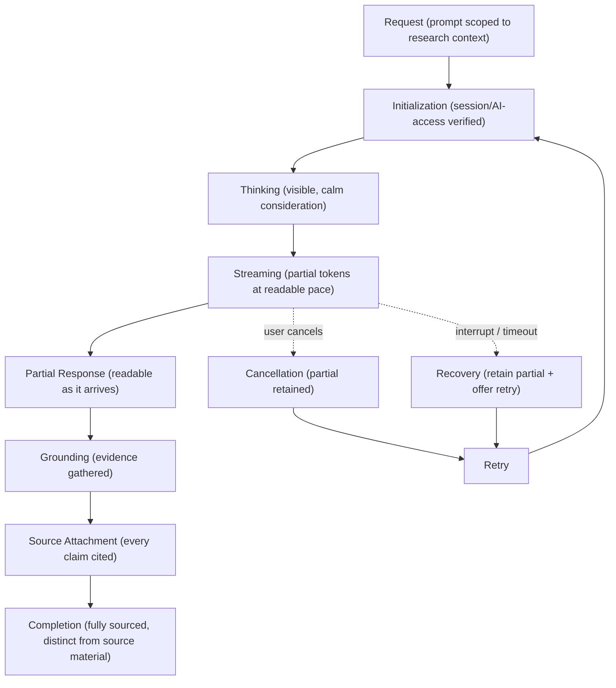

# AlphaScribe vNext — AI Streaming Lifecycle Architecture

| Field | Value |
|-------|-------|
| **Document Status** | ✅ Approved in Principle (CTO) — Refinement Pass Applied |
| **Version** | 0.1.1 |
| **Owner** | Frontend Architecture |
| **Approved By** | CTO — approved in principle |
| **Department / Milestone** | Frontend Architecture · M3 — Data & State Architecture |
| **Governed by** | [Constitution](01_Frontend_Architecture_Constitution.md) · [02 Application Architecture](02_Application_Architecture.md) · [03 Data & State](03_Data_and_State_Architecture.md) |
| **Last Updated** | 2026-07-19 |

## Revision History

| Version | Date | Author | Status | Description |
|---------|------|--------|--------|-------------|
| 0.1.1 | 2026-07-19 | Frontend Architecture | Refinement pass | Created in the Milestone 3 CTO refinement pass. Consolidates AI streaming — previously distributed across [03.2](03.2_Server_State_Strategy.md) and [03.11](03.11_Error_Boundary_and_Recovery.md) — into one first-class lifecycle reference. Restates, does not change, those decisions. |

## Purpose

Define the **end-to-end architecture of AI streaming** as a first-class concern of an AI-native platform:
the complete lifecycle from request to recovery, who owns each stage, how the stages interact with the
frontend layers and the backend, and the guarantees the experience makes to the user. It **consolidates**
the streaming decisions already made in [03.2](03.2_Server_State_Strategy.md) and
[03.11](03.11_Error_Boundary_and_Recovery.md) into one reference; it introduces no new behavior and
describes architecture only.

## Scope

**In scope:** the AI streaming lifecycle and its stages, architectural ownership and responsibilities,
lifecycle boundaries, interaction with frontend layers and the backend, user guarantees, and recovery
expectations. **Out of scope:** implementation, transport/protocol mechanics, model/agent internals
(backend, §6.2), and the AI *component visuals* (frozen Experience Design).

## Dependencies

[Constitution](01_Frontend_Architecture_Constitution.md) §4.6, §4.7, §4.13, §4.15, §6, §7 (streaming);
[02.6 UI Layer](02.6_UI_Layer_Architecture.md); [03.2 Server State AD-6](03.2_Server_State_Strategy.md),
[03.3 API Layer AD-5](03.3_API_Layer_Architecture.md), [03.4 Data Fetching AD-4](03.4_Data_Fetching_Strategy.md),
[03.11 Error & Recovery AD-7](03.11_Error_Boundary_and_Recovery.md); frozen **Design Constitution §8 (AI
Integration), §9 (AI Experience)**, Immutable Laws 3–5 & 8, [States: AI Thinking / AI Streaming](../design/13_States.md#ai-thinking),
[AI Components family](../experience_design/Components/08_AI_Components.md).

## Architectural Principles

1. **Streaming is first-class, not an afterthought.** AlphaScribe is AI-native; the streaming lifecycle is a
   core architectural concern with defined stages, ownership, and guarantees — not an ad-hoc effect.
2. **Grounded and traceable, always.** Every completed AI claim carries a reachable source (Law 3; §22);
   the lifecycle exists partly to make **grounding and source attachment** explicit stages, not incidental.
3. **Calm, embedded, felt — never performed.** The experience reads as a research partner thinking and
   gathering evidence (§9), never theatrics; streaming is paced to be readable (§7).
4. **Never lose produced work.** Partial output is retained through interruption, cancellation, and timeout
   (Law 6; §4.13) — streaming failure is never a silent loss.
5. **Honest about uncertainty.** The lifecycle never fabricates confidence or sources; incompleteness is
   surfaced honestly (Laws 4, 8).

## Architectural Decisions

### AD-1 — The canonical streaming lifecycle (stages)
The lifecycle proceeds through defined stages; each is an architectural state with clear entry/exit
conditions. (This restates and unifies the frozen States and [03.2](03.2_Server_State_Strategy.md)/[03.11](03.11_Error_Boundary_and_Recovery.md);
no new behavior.)

| Stage | Meaning | Frozen anchor |
|-------|---------|---------------|
| **Request** | The user asks, scoped to the current research subject (never a context-free chatbot) | §8; Law 5 |
| **Initialization** | Session + AI-access validated; the exchange is set up in context | [03.6](03.6_Authentication_Architecture.md)/[03.7](03.7_Authorization_Architecture.md) |
| **Thinking** | Visible, calm "considering" before output | States: AI Thinking; §9 |
| **Streaming** | Output emerges progressively at a human, readable pace | States: AI Streaming; §7 |
| **Partial Response** | Partial output is readable as it arrives | §9; §21 |
| **Grounding** | Evidence is drawn upon; sourcing made felt | §22; Law 3 |
| **Source Attachment** | Sources attach as claims resolve; reachable | §22; States |
| **Completion** | Fully sourced, visibly distinct from source material | §22; Law 3 |
| **Cancellation** | User stops; produced partial is retained | Law 6; States |
| **Retry** | Re-initiates from a clean state, prior content preserved | [03.11 AD-7](03.11_Error_Boundary_and_Recovery.md) |
| **Recovery** | Interruption/timeout retains partial + offers retry | States: Timeout; Law 6 |

### AD-2 — Architectural ownership per stage
- **Backend (§6.2):** owns *thinking*, generation, *grounding*, and *source production* — the AI/agent
  pipeline and retrieval. The frontend never generates or grounds content.
- **Integration layer:** owns the **streaming boundary** — consuming the stream, validating/normalizing
  arriving content and attached sources, and normalizing interruption/timeout ([03.3 AD-5](03.3_API_Layer_Architecture.md)).
- **Application layer:** owns the **streamed server-state** — accumulating partial output, tracking stage,
  retaining partials, and orchestrating cancel/retry ([03.2 AD-6](03.2_Server_State_Strategy.md)).
- **UI layer (client island):** owns **presentation** — rendering thinking/streaming/partial/grounding/
  sourced states at a readable pace, keeping AI content distinct from source, with reduced-motion honored
  ([02.6](02.6_UI_Layer_Architecture.md); frozen Motion/AI components).

### AD-3 — Lifecycle boundaries
- **Request → Initialization** is gated by authentication + valid AI access ([03.6](03.6_Authentication_Architecture.md)/[03.7](03.7_Authorization_Architecture.md));
  without access, the lifecycle does not start — the user is routed to AI Setup (Permission Denied).
- **Thinking → Streaming** is the backend beginning to produce output.
- **Grounding/Source Attachment** are within/after streaming, not a separate destination — evidence attaches
  as claims resolve; **Completion requires that every claim is sourced** (a hard boundary; an unsourced
  completion is a defect, §4.13).
- **Cancellation/Recovery** may branch from Streaming/Partial at any point, always retaining produced output.

### AD-4 — Interaction with frontend layers
The lifecycle flows through the standard layered path ([02](02_Application_Architecture.md)): integration
consumes and validates the stream → application accumulates streamed server-state and tracks the stage → UI
binds and renders it in a client island. Data flows one way (down to the view); user actions (cancel/retry)
flow up as events to application use-cases ([03.10](03.10_Data_Flow_Principles.md)).

### AD-5 — Interaction with the backend
The frontend consumes an **AI stream over the API contract** ([03.3](03.3_API_Layer_Architecture.md)); the
backend is authoritative for content, grounding, and sources. The frontend **faithfully preserves and
presents** what the backend grounds — it never fabricates, reorders, or invents sources, and never presents
AI output as source material (trust boundary; §22).

### AD-6 — Guarantees to the user
- **Visible progress:** the user always perceives motion — thinking, gathering, streaming — never a frozen
  void (§9, §21).
- **Readable pace:** output arrives legibly, never a jarring dump (§7).
- **Grounded completion:** every completed claim is source-traceable (Law 3; §22).
- **Distinct provenance:** AI content is always visibly distinguishable from source material (§22).
- **Honest limits:** uncertainty/insufficient-evidence is stated, never masked (Laws 4, 8).
- **No recommendations:** the assistant informs; it never advises buy/sell (Law 4).
- **No lost work:** produced partial output survives cancel/interrupt/timeout (Law 6).

### AD-7 — Recovery expectations
Interruption, cancellation, or timeout **retains the produced partial output**, keeps prior content, and
offers a **retry** that re-initializes cleanly; on eventual completion, all sources attach
([03.11 AD-7](03.11_Error_Boundary_and_Recovery.md)). Recovery is announced accessibly and never silently
drops content. Repeated failures on a trust-critical AI path are observable (§4.15).

## Responsibilities

| Concern | Owner |
|---------|-------|
| Thinking, generation, grounding, source production | **Backend** (§6.2) |
| Stream consumption, validation, normalization of interruption/timeout | **Integration layer** |
| Streamed-state accumulation, stage tracking, partial retention, cancel/retry orchestration | **Application layer** |
| Readable-pace presentation; AI-vs-source distinction; accessibility of streaming/announcements | **UI layer** |
| Grounding/traceability integrity end-to-end | **All layers** (trust boundary) |

## Trade-offs

- **Readable-pace streaming vs. raw speed:** pacing output for legibility is slightly slower than a dump but
  is the frozen experience requirement (§7, §9). Accepted.
- **Retain-partials + retry vs. simplicity:** preserving partial output through failure is more complex than
  discarding, but it is the Never-Lose-Work guarantee for AI (Law 6). Accepted.
- **Grounded-completion hard boundary vs. faster completion:** requiring every claim sourced before
  "complete" adds rigor at the finish, protecting trust. Accepted (trust-first).

## Risks

- **Unsourced completion** slipping through. *Mitigation:* the grounded-completion boundary (AD-3) +
  boundary validation (§4.13); an unsourced claim is a blocking defect.
- **AI content mistaken for source.** *Mitigation:* distinct-provenance guarantee (AD-6); frozen AI-component
  distinction.
- **Lost partial output** on interruption. *Mitigation:* retain-partials recovery (AD-7).
- **Theatrical/over-animated streaming.** *Mitigation:* calm-embedded principle (§9); reduced-motion honored
  (frozen Motion).

## Future Extension Points

- **Multi-turn conversation continuity** (the roadmap's future AI Conversation Lifecycle documentation)
  builds on this single-exchange lifecycle without changing its stages (§4.14).
- **Additional grounding modalities** (new source types) extend Grounding/Source Attachment without altering
  the lifecycle shape.
- **Streaming for non-AI progressive content** reuses the pacing/partial principles.

## References

M1 [Constitution](01_Frontend_Architecture_Constitution.md) §4.6/§4.7/§4.13/§4.15/§6/§7; M2 [02.6](02.6_UI_Layer_Architecture.md);
M3 [03.2](03.2_Server_State_Strategy.md)/[03.3](03.3_API_Layer_Architecture.md)/[03.4](03.4_Data_Fetching_Strategy.md)/[03.11](03.11_Error_Boundary_and_Recovery.md).
Frozen: Design Constitution §8/§9 + Laws 3–5/8, [States](../design/13_States.md), [AI Components](../experience_design/Components/08_AI_Components.md).

---

*Frontend Architecture · Milestone 3 · Document 03.13 · v0.1.1*
