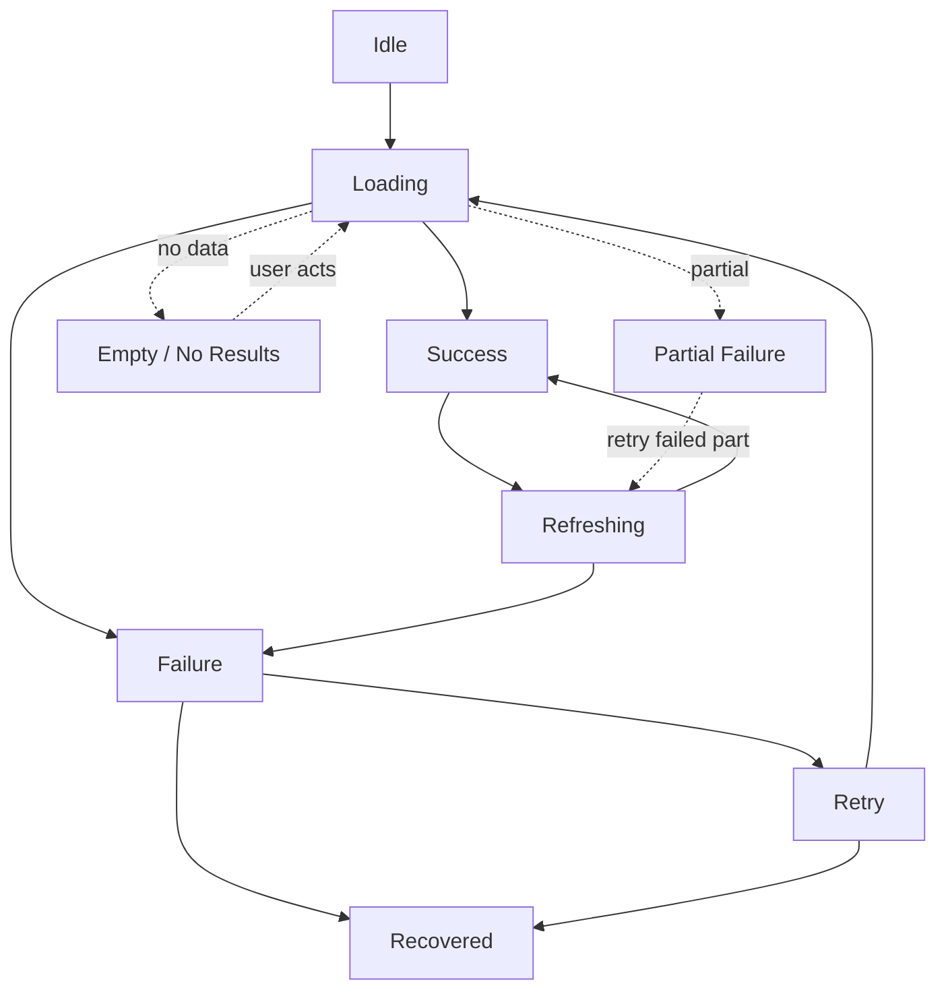
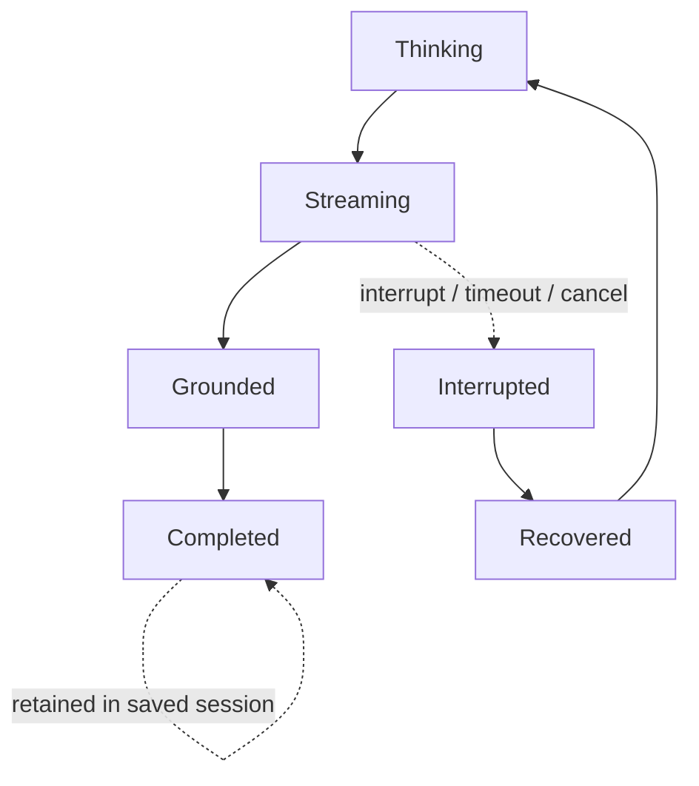

# AlphaScribe vNext — State Transition Philosophy

| Field | Value |
|-------|-------|
| **Document Status** | ✅ Approved in Principle (CTO) — Refinement Pass Applied |
| **Version** | 0.1.1 |
| **Owner** | Frontend Architecture |
| **Approved By** | CTO — approved in principle |
| **Department / Milestone** | Frontend Architecture · M3 — Data & State Architecture |
| **Governed by** | [Constitution](01_Frontend_Architecture_Constitution.md) · [02 Application Architecture](02_Application_Architecture.md) · [03 Data & State](03_Data_and_State_Architecture.md) |
| **Last Updated** | 2026-07-19 |

## Revision History

| Version | Date | Author | Status | Description |
|---------|------|--------|--------|-------------|
| 0.1.1 | 2026-07-19 | Frontend Architecture | Refinement pass | Created in the Milestone 3 CTO refinement pass. Defines the philosophy governing state transitions, unifying the frozen [States](../design/13_States.md) and the M3 recovery/streaming decisions. No new behavior. |

## Purpose

Define the **architectural philosophy governing every state transition** in the frontend — how data and AI
surfaces move between states (idle, loading, success, refreshing, failure, retry, recovered; and thinking,
streaming, grounded, completed, interrupted, recovered). It ensures transitions are **predictable,
consistent, recoverable, clearly owned, and resilient**, so behavior is uniform across the product and no
engineer must invent transition logic. Philosophy only — no implementation.

## Scope

**In scope:** the principles of state transitions for data surfaces and AI surfaces; predictability,
consistency, recoverability, ownership, and resilience of transitions. **Out of scope:** implementation
(state machines/libraries), the frozen [States](../design/13_States.md) definitions (referenced, not
redefined), and any new state.

## Dependencies

[Constitution](01_Frontend_Architecture_Constitution.md) §3 (predictability), §4.10 (predictable data flow),
§4.13 (Fail Fast), §6.3 (never-lose-work); [03 Data & State](03_Data_and_State_Architecture.md),
[03.2 Server State](03.2_Server_State_Strategy.md), [03.11 Error & Recovery](03.11_Error_Boundary_and_Recovery.md),
[03.13 AI Streaming](03.13_AI_Streaming_Lifecycle_Architecture.md), [03.10 Data Flow](03.10_Data_Flow_Principles.md);
frozen [States](../design/13_States.md) (the canonical state set), Design Constitution §20 + Law 13 (every
state offers a way forward), Law 6 (never lose work).

## Architectural Principles

1. **Predictability.** The same action from the same state always produces the same transition and outcome
   (§3, §4.10). Transitions are anticipable, not emergent.
2. **Consistency.** A given kind of surface transitions the **same way everywhere** — a data surface's
   loading→success→failure behaves identically across features; an AI surface's thinking→streaming→completed
   is uniform. One vocabulary of states ([States](../design/13_States.md)), one set of transitions.
3. **Recoverability.** Every non-terminal-happy state has a defined transition **forward** — retry,
   refine, reconnect, re-auth, or an alternative — so the user is never trapped (Law 13; §20;
   [03.11](03.11_Error_Boundary_and_Recovery.md)).
4. **Clear ownership.** Each transition is driven by the **owner of the underlying state** ([03.14](03.14_Data_Ownership_Matrix.md)):
   server-state transitions follow query/mutation status; AI transitions follow the streaming lifecycle;
   form transitions follow the form lifecycle. Transitions are never triggered by an unrelated actor.
5. **Resilience.** Transitions distinguish **expected** movements (into frozen States) from **unexpected**
   failures (fail fast, §4.13); neither loses the user's work (Law 6). A failed transition degrades to a
   recoverable state, never a corrupt or frozen one.

## Architectural Decisions

### AD-1 — The canonical data-surface transition model
Data surfaces move through a defined set of states from the frozen [States](../design/13_States.md);
transitions are uniform:

- **Idle → Loading → Success** is the happy path; **Success → Refreshing → Success** is background
  revalidation (the user keeps seeing data while it refreshes — never flashing back to a blank).
- **Failure → Retry → (Loading | Recovered)** and **Partial Failure → retry-failed-part** keep the user
  moving forward; **Empty/No Results** offer a next step. Every edge preserves prior content and the user's
  place (Law 6).

### AD-2 — The canonical AI-surface transition model
AI surfaces follow the streaming lifecycle ([03.13](03.13_AI_Streaming_Lifecycle_Architecture.md)):

- **Thinking → Streaming → Grounded → Completed** is the happy path; **Completed** requires every claim
  sourced (a hard boundary — [03.13 AD-3](03.13_AI_Streaming_Lifecycle_Architecture.md)).
- **Interrupted → Recovered** retains produced partial output and offers retry (Law 6); the surface never
  transitions to a blank or an unsourced "done."

### AD-3 — Transitions are driven by state owners, not the view
A transition is initiated by an event flowing **up** to the owning use-case, which changes state, which
re-renders the view ([03.10](03.10_Data_Flow_Principles.md)). Presentational components **reflect**
transitions; they do not drive them. This keeps transition logic in one predictable place per surface.

### AD-4 — Expected vs. unexpected transitions
- **Expected transitions** move between frozen States and are handled gracefully and accessibly.
- **Unexpected conditions** (invalid data, violations) **fail fast** into a contained, recoverable error
  transition (§4.13; [03.11](03.11_Error_Boundary_and_Recovery.md)) — never a silent or corrupt transition.
The two paths are always explicit.

### AD-5 — No transition loses work or traps the user
Every transition is evaluated against Law 6 and Law 13: it must **preserve in-progress work** and **offer a
way forward**. A transition that would discard the user's research or dead-end them is prohibited; recovery
transitions restore context (Resume Session, J-06).

### AD-6 — Announced and accessible transitions
State changes are **announced accessibly** (frozen Accessibility) at the appropriate politeness (e.g. polite
for success/streaming, assertive for blocking errors) and honor reduced motion — a transition is legible to
every user, never conveyed by motion/color alone.

## Responsibilities

| Concern | Owner |
|---------|-------|
| Driving a surface's transitions from its state owner | **Application layer** (per [03.14](03.14_Data_Ownership_Matrix.md)) |
| Rendering/announcing transitions accessibly, at a readable pace | **UI layer** |
| Defining the canonical states these transitions move between | **Frozen [States](../design/13_States.md)** (Product Design) |
| Guaranteeing no transition loses work or traps the user | **All layers** (Laws 6 & 13) |

## Trade-offs

- **Uniform transition vocabulary vs. per-surface freedom:** enforcing one transition model per surface type
  removes local creativity but delivers the consistency and predictability the product requires. Accepted.
- **Refreshing-shows-stale-briefly vs. blank-on-refresh:** keeping prior data during Refreshing shows
  momentarily older data, but avoids jarring blanks and preserves the user's place; freshness is reconciled
  ([03.5](03.5_Caching_Strategy.md)). Accepted (continuity over purity).

## Risks

- **Divergent, ad-hoc transitions** across features. *Mitigation:* the canonical models (AD-1/AD-2) + review;
  one State vocabulary.
- **Silent/corrupt transitions** on unexpected failure. *Mitigation:* fail-fast expected/unexpected split
  (AD-4).
- **Work lost or user trapped in a transition.** *Mitigation:* AD-5 (Laws 6 & 13) as a hard rule.

## Future Extension Points

- New surface types adopt one of the canonical models (data or AI) or extend them additively without
  changing existing transitions (§4.14).
- Multi-turn AI conversation transitions (future roadmap documentation) extend the AI model while preserving
  its stages.
- Formalizing transitions as explicit state machines is an implementation choice these principles already
  permit and constrain.

## References

M1 [Constitution](01_Frontend_Architecture_Constitution.md) §3/§4.10/§4.13/§6.3; M2 [02.6](02.6_UI_Layer_Architecture.md);
M3 [03](03_Data_and_State_Architecture.md)/[03.2](03.2_Server_State_Strategy.md)/[03.10](03.10_Data_Flow_Principles.md)/[03.11](03.11_Error_Boundary_and_Recovery.md)/[03.13](03.13_AI_Streaming_Lifecycle_Architecture.md)/[03.14](03.14_Data_Ownership_Matrix.md).
Frozen: [States](../design/13_States.md), Design Constitution §20 + Laws 6 & 13, [Accessibility](../design/12_Accessibility.md).

---

*Frontend Architecture · Milestone 3 · Document 03.15 · v0.1.1*
