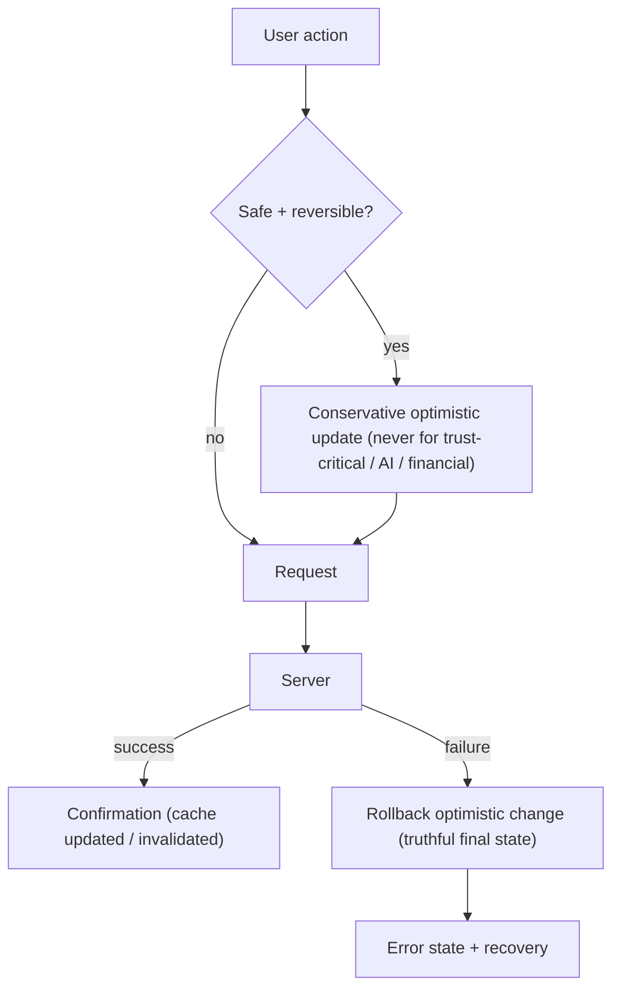

# AlphaScribe vNext — Server State Strategy

| Field | Value |
|-------|-------|
| **Document Status** | ✅ Approved in Principle (CTO) — Refinement Pass Applied |
| **Version** | 0.1.1 |
| **Owner** | Frontend Architecture |
| **Approved By** | CTO — approved in principle |
| **Department / Milestone** | Frontend Architecture · M3 — Data & State Architecture |
| **Governed by** | [Constitution](01_Frontend_Architecture_Constitution.md) · [03 Data & State](03_Data_and_State_Architecture.md) |
| **Last Updated** | 2026-07-19 |

## Revision History

| Version | Date | Author | Status | Description |
|---------|------|--------|--------|-------------|
| 0.1.0 | 2026-07-19 | Frontend Architecture | Draft (approved in principle) | Initial Milestone 3 document. |
| 0.1.1 | 2026-07-19 | Frontend Architecture | Refinement pass | CTO refinement pass: metadata standardized; documents 03.12–03.15 and architecture sequence diagrams added to the Milestone 3 package. No approved architectural decision changed. |

## Purpose

Define the architecture of **server state** — data owned by the backend and worked with client-side —
managed with **TanStack Query**: what qualifies, the query-key model, freshness/refetch philosophy,
mutation strategy, and how AI streaming and best-effort data are handled — all without duplicating server
state into client stores.

## Scope

**In scope:** server-state ownership, query-key architecture, freshness/staleness, mutations, optimistic
philosophy, streaming, best-effort handling. **Out of scope:** caching mechanics detail ([03.5](03.5_Caching_Strategy.md)),
the API client ([03.3](03.3_API_Layer_Architecture.md)), client state ([03.1](03.1_State_Management_Strategy.md)),
implementation.

## Dependencies

[03 Data & State](03_Data_and_State_Architecture.md) (AD-1/AD-2); [Constitution](01_Frontend_Architecture_Constitution.md)
§4.9, §4.10, §4.13, §4.15, §6; [03.3 API Layer](03.3_API_Layer_Architecture.md), [03.5 Caching](03.5_Caching_Strategy.md),
[03.4 Data Fetching](03.4_Data_Fetching_Strategy.md); frozen [IA entities](../design/03_Information_Architecture.md#information-relationships),
[States](../design/13_States.md), best-effort-data + trust-first (Vision).

## Architectural Decisions

### AD-1 — Server state = backend-owned data; TanStack Query is its sole client owner
All remote, backend-owned data — companies, financial metrics/statements, SEC/BSE filings, AI summaries/
answers, comparisons, research sessions, reports, history — is **server state**, owned client-side by
**TanStack Query** as a **cache of server truth**. **The server remains the single source of truth;** the
client cache is a working copy, never a second authority. Server state is **never copied into Zustand**
([03 AD-1](03_Data_and_State_Architecture.md)).

### AD-2 — Semantic, hierarchical query keys tied to entities
Query keys are **semantic and derived from the frozen entities** (company, filing, statement-set,
comparison, session, report) and their parameters (e.g. company id, period, filing id), forming a stable,
hierarchical key space. This makes caching, invalidation, and refetch **predictable and targeted** (§4.10)
and lets related data be invalidated together (e.g. a company's derived views on refresh). Keys are a
stable public contract of the data layer (§4.12).

### AD-3 — Freshness/staleness reflects data volatility
Freshness is configured **per data type** by how often it truly changes:
- **Slow-changing** (filed statements, historical filings) → long freshness; served from cache, background-
  revalidated.
- **Session/derived research** (sessions, reports) → moderate; kept consistent with the user's saved work.
- **Live/AI** (streaming answers) → treated as fresh/one-shot, not long-cached as reusable truth.
Server truth always wins on refetch; the UI never presents stale data *as* current where freshness matters
to trust ([03.5](03.5_Caching_Strategy.md)).

### AD-4 — Mutation strategy
State-changing operations (save/resume a session, generate/export a report, validate AI access, update
settings, add/remove watchlist server-side if applicable) are **mutations** that go through the
Application-layer use-case → Integration layer → server, then **update or invalidate** the relevant
server-state cache so the UI reflects the new truth. Mutations are explicit, typed, validated, and their
success/error map to frozen [States](../design/13_States.md) (Success/Error/Timeout).

### AD-5 — Optimistic updates: conservative and trust-aware
Optimistic updates are applied **only where the outcome is safe, reversible, and non-authoritative** — e.g.
a UI-level watchlist toggle or a clearly reversible action — always with rollback on failure and a truthful
final state. They are **not** used for **trust-critical or financial/AI-authoritative data**: an AI answer,
a grounded metric, or a report is shown only once the server confirms it — never optimistically fabricated
(this would violate trust-first and Fail Fast, §4.13). Prefer accurate acknowledgment over premature
optimism.

### AD-6 — AI streaming as first-class server state
AI responses **stream** (Constitution §7; frozen States: AI Streaming). Server state handling accommodates
progressive arrival — partial content readable as it resolves, **sources attaching as claims resolve**, and
**partial output retained** on interruption/timeout with a retry ([03.11](03.11_Error_Boundary_and_Recovery.md)).
Streamed AI state is never silently dropped and never presented without its (arriving) sources.

### AD-7 — Best-effort external data → partial/degraded, never crash
Because external sources are best-effort (frozen Vision), server-state queries model **partial success**:
a surface renders what succeeded and flags what failed (frozen **Partial Failure**), or resolves to
**Timeout/Offline** — never an all-or-nothing crash ([03.4](03.4_Data_Fetching_Strategy.md)).

## Architecture Sequence Diagram

Mutation (write) lifecycle (reinforces AD-4/AD-5; optimism is conservative — never for trust-critical/AI/
financial data; introduces no new behavior):

## Design Rationale

Letting TanStack Query own server state — with semantic keys, volatility-based freshness, and disciplined
mutations — gives correct caching, background refetch, and invalidation "for free," eliminates the
duplication that manual global stores cause, and keeps the server as the single source of truth. Conservative
optimism and streaming-aware handling protect the product's trust promise: the user never sees fabricated or
stale-as-fresh financial/AI data.

## Alternatives Considered

- **Hand-rolled fetching + global-store caching** — rejected: reinvents Query poorly, duplicates server
  truth, and scatters invalidation logic (contra "prevent duplicated state", §4.10).
- **Aggressive optimistic updates everywhere** — rejected: risks showing unconfirmed financial/AI data,
  violating trust-first and Fail Fast (§4.13).
- **Caching AI stream output as long-lived reusable truth** — rejected: AI answers are contextual/one-shot;
  treating them as durable cache risks staleness and mis-grounding.

## Trade-offs

- **Cache freshness vs. network cost:** longer freshness reduces requests but risks staleness; tuned per
  data type to balance trust and performance (AD-3).
- **Conservative optimism vs. snappiness:** declining optimism on trust-critical data costs a little
  perceived speed but protects correctness — a deliberate trust-first trade (AD-5).

## Risks

- **Stale-as-fresh** eroding trust. *Mitigation:* volatility-based freshness + server-authoritative
  refetch (AD-3).
- **Server data mirrored into client state.** *Mitigation:* [03 AD-2](03_Data_and_State_Architecture.md)
  boundary + review.
- **Streaming edge cases** (dropped/partial) losing content. *Mitigation:* retain-partials + retry
  ([03.11](03.11_Error_Boundary_and_Recovery.md)).

## Future Extension Points

- New backend entities enter as new query domains behind stable keys (§4.14).
- Real-time subscriptions (future) integrate as an additional server-state transport, still Query-owned.
- Persisted/offline server-state cache extends [03.5](03.5_Caching_Strategy.md) without ownership changes.

## References to Previous Milestones

M1 §4.9/§4.10/§4.13/§4.15/§6; M2 [02](02_Application_Architecture.md)/[02.6](02.6_UI_Layer_Architecture.md);
M3 [03](03_Data_and_State_Architecture.md). Frozen: IA entities, States, best-effort/trust-first Vision.

---

*Frontend Architecture · Milestone 3 · Document 03.2 · v0.1.0 (Draft)*
