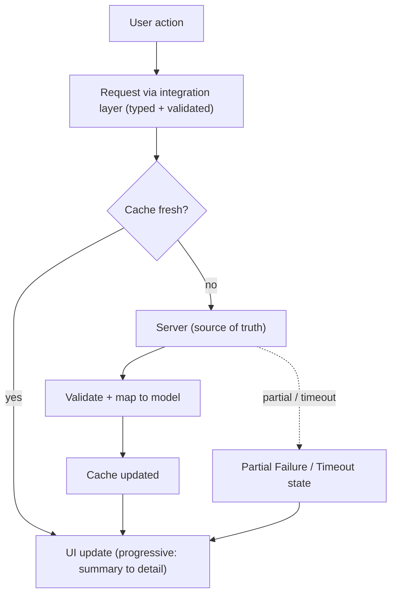

# AlphaScribe vNext — Data Fetching Strategy

| Field | Value |
|-------|-------|
| **Document Status** | ✅ Approved in Principle (CTO) — Refinement Pass Applied |
| **Version** | 0.1.1 |
| **Owner** | Frontend Architecture |
| **Approved By** | CTO — approved in principle |
| **Department / Milestone** | Frontend Architecture · M3 — Data & State Architecture |
| **Governed by** | [Constitution](01_Frontend_Architecture_Constitution.md) · [03 Data & State](03_Data_and_State_Architecture.md) |
| **Last Updated** | 2026-07-19 |

## Revision History

| Version | Date | Author | Status | Description |
|---------|------|--------|--------|-------------|
| 0.1.0 | 2026-07-19 | Frontend Architecture | Draft (approved in principle) | Initial Milestone 3 document. |
| 0.1.1 | 2026-07-19 | Frontend Architecture | Refinement pass | CTO refinement pass: metadata standardized; documents 03.12–03.15 and architecture sequence diagrams added to the Milestone 3 package. No approved architectural decision changed. |

## Purpose

Define **where and how data is fetched** — the split between server-side and client-side fetching, the
ordering and progressiveness of fetches, streaming/incremental loading, and resilience — so data arrives
performantly, progressively, and reliably, consistent with the frozen rendering philosophy and States.

## Scope

**In scope:** server vs. client fetching, fetch ownership/placement, prefetching, ordering (parallel/
sequential/progressive), streaming/incremental, resilience/partial fetching. **Out of scope:** caching
config ([03.5](03.5_Caching_Strategy.md)), API-client structure ([03.3](03.3_API_Layer_Architecture.md)),
implementation.

## Dependencies

[Constitution](01_Frontend_Architecture_Constitution.md) §4.7 (Performance by Design), §4.13, §7 (Rendering);
[02.6 UI Layer](02.6_UI_Layer_Architecture.md), [02.3 Routing](02.3_Routing_Architecture.md); [03.2 Server
State](03.2_Server_State_Strategy.md), [03.3 API Layer](03.3_API_Layer_Architecture.md); frozen
[IA content hierarchy](../design/03_Information_Architecture.md) (summary before detail),
[States](../design/13_States.md) (Skeleton/Loading/Partial Failure/Timeout), Constitution §21 (performance-
aware, frozen Design).

## Architectural Decisions

### AD-1 — Fetch on the server by default; on the client for interactive/live data
Per Constitution §7 and [02.6](02.6_UI_Layer_Architecture.md):
- **Server-side fetching (default)** for content-led, read-heavy surfaces (statements, filings, reports) —
  data close to source, minimal client payload, better perceived performance/SEO.
- **Client-side fetching (TanStack Query)** for interactive, user-triggered, and live data — the AI
  companion/streaming, filtered/paginated lists, on-demand refreshes.
The choice is per surface, made deliberately against performance budgets (§4.7), not by default habit.

### AD-2 — Progressive, summary-before-detail loading
Fetching mirrors the frozen [IA hierarchy](../design/03_Information_Architecture.md) and perceived-
performance philosophy (§21): **the summary/overview loads first and becomes usable before deeper detail**
(business summary/KPIs before full statements/filings). This turns waiting into visible progress and lets
the user begin reading before everything resolves.

### AD-3 — Parallelize independent data; sequence only true dependencies
Independent data for a surface is fetched **in parallel**; **sequential** fetching is used only where a real
data dependency exists (e.g. a comparison needs its member company subjects first). This minimizes total
wait and avoids request waterfalls (§4.7).

### AD-4 — Streaming and incremental rendering for AI and large content
AI output **streams** and renders incrementally at a readable pace ([03.2 AD-6](03.2_Server_State_Strategy.md),
§7); large/structured content renders progressively behind **Skeleton** boundaries that preserve layout
(frozen States). The user is never shown a frozen blank while data loads.

### AD-5 — Loading is scoped and expressed as frozen States
Every fetch resolves through the frozen [States](../design/13_States.md): **Skeleton/Loading** while
pending (scoped to the affected region, navigation stays available), then Loaded, **Empty**, **No Results**,
**Error**, **Partial Failure**, or **Timeout**. Loading is region-scoped, never a global blocking spinner
where a scoped one suffices (§21).

### AD-6 — Resilient, partial, best-effort fetching
Because external data is best-effort (frozen Vision), a multi-source surface fetches so that **partial
success is renderable**: succeeded parts show, failed parts flag as **Partial Failure**, and long waits
resolve to **Timeout** with retry — never an all-or-nothing failure ([03.11](03.11_Error_Boundary_and_Recovery.md)).
Fetching **only what the surface needs** (no over-fetching) is a standing rule (§4.7, §4.11).

## Architecture Sequence Diagram

Query (read) lifecycle (reinforces AD-1–AD-6; introduces no new behavior):

## Design Rationale

Server-first, progressive, parallelized fetching directly implements the frozen performance-aware and
summary-before-detail principles: the product feels fast on imperfect networks, and the user is reading
useful content while the rest streams in. Expressing every fetch through the frozen States, and modeling
partial/best-effort explicitly, makes resilience and trust structural rather than per-screen effort.

## Alternatives Considered

- **Client-fetch everything (SPA-style)** — rejected: worse first paint/SEO, more client cost (contra §7,
  §4.7).
- **Fetch-all-then-render (block until complete)** — rejected: violates perceived-performance and summary-
  before-detail; a slow source would stall the whole surface (contra §21).
- **Sequential fetching by default** — rejected: creates waterfalls; parallelism is the default, sequencing
  only for real dependencies.

## Trade-offs

- **Server-first vs. interaction latency:** some interactions incur a round-trip; mitigated by client
  islands + prefetch (§7). Accepted.
- **Progressive complexity vs. simplicity:** progressive/partial loading is more complex than fetch-all,
  but it is what the frozen experience requires; complexity is contained in the data layer, not the UI.

## Risks

- **Waterfalls** from accidental sequencing. *Mitigation:* parallel-by-default rule (AD-3); review.
- **Over-fetching** harming performance. *Mitigation:* fetch-only-what's-needed (§4.7); per-surface data
  scoping.
- **Wrong server/client placement.** *Mitigation:* explicit per-surface decision (AD-1) against budgets.

## Future Extension Points

- Real-time/live surfaces extend the streaming model (§4.14) without changing read-surface fetching.
- Prefetch heuristics (e.g. anticipating the next research step) can be added as a performance enhancement
  behind the same data layer.
- Offline-first read of previously fetched research builds on [03.5](03.5_Caching_Strategy.md).

## References to Previous Milestones

M1 §4.7/§4.11/§4.13/§7; M2 [02.3](02.3_Routing_Architecture.md)/[02.6](02.6_UI_Layer_Architecture.md);
M3 [03.2](03.2_Server_State_Strategy.md)/[03.3](03.3_API_Layer_Architecture.md). Frozen: IA hierarchy,
States, performance-aware Design (§21).

---

*Frontend Architecture · Milestone 3 · Document 03.4 · v0.1.0 (Draft)*
