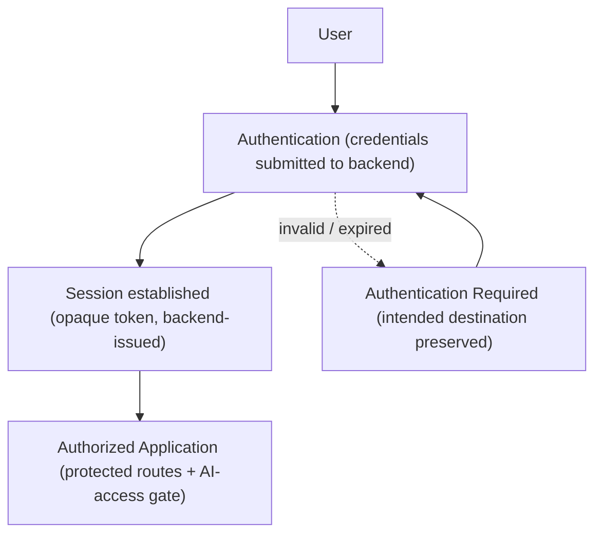

# AlphaScribe vNext — Authentication Architecture (Frontend)

| Field | Value |
|-------|-------|
| **Document Status** | ✅ Approved in Principle (CTO) — Refinement Pass Applied |
| **Version** | 0.1.1 |
| **Owner** | Frontend Architecture |
| **Approved By** | CTO — approved in principle |
| **Department / Milestone** | Frontend Architecture · M3 — Data & State Architecture |
| **Governed by** | [Constitution](01_Frontend_Architecture_Constitution.md) · [03 Data & State](03_Data_and_State_Architecture.md) |
| **Last Updated** | 2026-07-19 |

## Revision History

| Version | Date | Author | Status | Description |
|---------|------|--------|--------|-------------|
| 0.1.0 | 2026-07-19 | Frontend Architecture | Draft (approved in principle) | Initial Milestone 3 document. |
| 0.1.1 | 2026-07-19 | Frontend Architecture | Refinement pass | CTO refinement pass: metadata standardized; documents 03.12–03.15 and architecture sequence diagrams added to the Milestone 3 package. No approved architectural decision changed. |

## Purpose

Define the **frontend authentication architecture**: how the frontend participates in the frozen login-wall
authentication, the session lifecycle it manages, how session context is handled and transported, and how
authentication states integrate with routing and data. **The backend owns authentication;** this document
defines only the frontend's role.

## Scope

**In scope:** frontend session lifecycle, session-context handling/transport, auth-state integration with
routing/data, credential-handling boundaries. **Out of scope:** backend auth implementation (frozen —
stdlib sessions, project guide); authorization/permissions ([03.7](03.7_Authorization_Architecture.md));
implementation.

## Dependencies

[Constitution](01_Frontend_Architecture_Constitution.md) §4.13, §6 (Boundaries); [02.3 Routing](02.3_Routing_Architecture.md)
(login-wall boundary), [02.4 Layout](02.4_Layout_Architecture.md) (shell); [03.3 API Layer](03.3_API_Layer_Architecture.md),
[03.5 Caching](03.5_Caching_Strategy.md); frozen **backend auth** (login wall; `hashlib.scrypt` password
hashing; opaque `secrets.token_urlsafe` session tokens hashed at rest in Mongo; **no JWT/OAuth SDK**; rate-
limited login; password-reset OTP via Resend — project guide), [States](../design/13_States.md#authentication-required)
(Authentication Required), [User Journeys](../design/02_User_Journeys.md) J-01, privacy/security rules.

## Architectural Decisions

### AD-1 — The backend owns authentication; the frontend consumes sessions
Authentication is a **backend responsibility** (§6.2): the backend verifies credentials, issues an **opaque
session token** (hashed at rest), and validates sessions. The frontend **never implements authentication,
never verifies credentials, and is never the security authority** — it initiates auth flows, transports the
session, and reflects auth state. This document must not, and does not, redesign the frozen backend scheme.

### AD-2 — Session lifecycle (frontend view)
```
Unauthenticated → (login / register flow, RHF+Zod form → backend) → Session established
   → Session in use (session context sent with every API request via the integration layer)
   → Expiry / invalidation (backend signals) → Authentication Required state → re-auth, intended
     destination preserved
   → Logout (explicit) → session ended, all session-scoped cache + client state cleared
```
- **Establishment:** credentials are submitted through a form ([03.8](03.8_Form_Architecture.md)) to the
  backend; on success the backend establishes the session. Managed vs. BYOK **AI access** is a separate,
  post-auth setup concern (authorization, [03.7](03.7_Authorization_Architecture.md)), not authentication.
- **Use:** the session is presented on every request by the integration layer ([03.3](03.3_API_Layer_Architecture.md));
  the frontend treats "am I authenticated?" as **backend-authoritative** (derived from the session/identity
  endpoint), not a client-held belief.
- **Expiry:** a backend "session invalid/expired" signal resolves to the frozen **Authentication Required**
  state; the **intended destination is preserved** so the user returns to it after re-auth (frozen States;
  J-06 never-lose-intent).
- **Logout:** ends the session server-side and **clears all session-scoped server-state cache and client
  UI state** ([03.5 AD-5](03.5_Caching_Strategy.md), [03.1 AD-4](03.1_State_Management_Strategy.md)).

### AD-3 — Credential and token handling boundaries (security)
- The frontend **never stores raw credentials or passwords**, never logs or announces them, and never
  places them in URLs (privacy/security rules; Design a11y: masked values never announced).
- The **session token is opaque** and handled as a transport concern only; the frontend prefers the token to
  live in a secure, `httpOnly`-style cookie managed by the backend rather than in JavaScript-accessible
  storage, minimizing exposure. (The exact cookie/transport mechanism is the backend's contract; the
  frontend consumes it and adds no weaker alternative.)
- **Password-reset OTP** and similar flows are backend-driven (Resend); the frontend renders the flow's
  forms/states, holding no secret material.

### AD-4 — Authentication is a routing boundary, not a per-component check
The login wall is enforced at the **routing boundary** ([02.3 AD-6](02.3_Routing_Architecture.md)): protected
destinations require a valid session; unauthenticated access resolves to Authentication Required with a
recoverable path — not scattered `if (loggedIn)` checks in components (§4.10 explicitness, §4.3).

### AD-5 — Auth state as (derived) server state
Authentication status/identity is **server state** (validated by the backend, cached via Query), not a
duplicated client flag ([03 AD-1](03_Data_and_State_Architecture.md)). The UI derives "authenticated" from
this single source; it is never mirrored into Zustand.

## Architecture Sequence Diagram

Authentication flow (reinforces AD-1–AD-5; introduces no new behavior):



## Design Rationale

Treating the backend as the authentication authority and the frontend as a consumer keeps the security
boundary where it belongs and prevents the frontend from becoming a false gate. Modeling auth status as
backend-authoritative server state avoids a duplicated, drift-prone client flag. Enforcing the wall at the
route boundary (not per component) centralizes the rule and makes protected access provable. Strict
credential/token boundaries uphold the product's privacy and trust posture and honor the frozen stdlib
scheme without redesigning it.

## Alternatives Considered

- **Client-side JWT/token in JS-accessible storage** — rejected: contradicts the frozen no-JWT, opaque-
  session design and increases exposure; the frontend consumes the backend's session mechanism as-is.
- **Per-component auth checks** — rejected: scattered, error-prone, easy to miss a protected surface
  (contra §4.10); the wall is a routing boundary.
- **Client-held "isAuthenticated" flag as source of truth** — rejected: duplicates server truth and drifts
  (contra "prevent duplicated state").

## Trade-offs

- **Backend-authoritative auth vs. instant client checks:** deriving auth from the backend costs a
  validation round-trip but is correct and secure; mitigated by caching the session/identity query. Accepted.
- **Cookie-based session vs. client token convenience:** a backend-managed secure cookie is less directly
  inspectable in JS but far safer. Accepted (security-first).

## Risks

- **Protected surface reachable while unauthenticated.** *Mitigation:* routing-boundary enforcement (AD-4)
  + QA; fail-fast on missing/invalid session (§4.13).
- **Sensitive session data persisting past logout.** *Mitigation:* clear-on-logout of cache + client state
  (AD-2).
- **Credential leakage** (logs, URLs, storage). *Mitigation:* strict handling boundaries (AD-3); never
  store/log/announce credentials.

## Future Extension Points

- Additional backend-provided auth methods (e.g. the roadmap's social sign-in) attach as new flows the
  frontend renders — no change to the consume-session model (§4.14).
- Multi-device session management, if added backend-side, is reflected by the same session-as-server-state
  model.

## References to Previous Milestones

M1 §4.10/§4.13/§6; M2 [02.3](02.3_Routing_Architecture.md)/[02.4](02.4_Layout_Architecture.md); M3 [03](03_Data_and_State_Architecture.md)/[03.3](03.3_API_Layer_Architecture.md)/[03.5](03.5_Caching_Strategy.md).
Frozen: backend login-wall auth, States (Auth Required), J-01, privacy/security rules.

---

*Frontend Architecture · Milestone 3 · Document 03.6 · v0.1.0 (Draft)*
