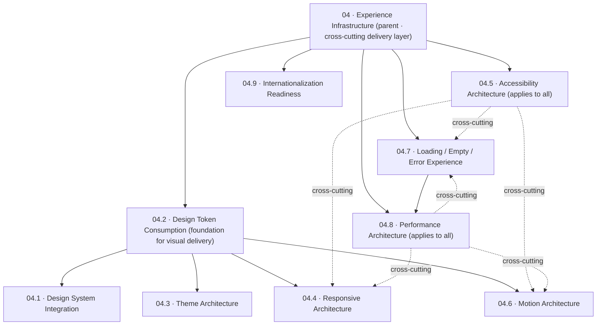

# AlphaScribe vNext — Experience Infrastructure

| Field | Value |
|-------|-------|
| **Document Status** | ✅ Approved (CTO) — Refinement Pass Applied |
| **Version** | 0.1.1 |
| **Owner** | Frontend Architecture |
| **Approved By** | CTO — architecturally approved |
| **Department / Milestone** | Frontend Architecture · M4 — Experience Infrastructure |
| **Governed by** | [Constitution (M1)](01_Frontend_Architecture_Constitution.md) · [Application Architecture (M2)](02_Application_Architecture.md) · [Data & State (M3)](03_Data_and_State_Architecture.md) |
| **Last Updated** | 2026-07-19 |
| **Source of Truth** | Yes — parent of the M4 experience-infrastructure documents (04.1–04.9 detail it) |

## Revision History

| Version | Date | Author | Status | Description |
|---------|------|--------|--------|-------------|
| 0.1.0 | 2026-07-19 | Frontend Architecture | 📝 Draft | Initial Milestone 4 parent: defines the experience-infrastructure layer that consistently delivers the frozen user experience. |
| 0.1.1 | 2026-07-19 | Frontend Architecture | ✅ Refinement pass | CTO refinement pass: added the Experience Infrastructure Overview diagram, Cross-Reference Matrix, and Quality Attribute Mapping; standardized metadata across M4. No architectural decision changed. |

## Purpose

Define the **experience infrastructure**: the cross-cutting architectural layer that **consistently and
faithfully delivers the approved user experience** — the frozen visual language, design system, tokens,
responsive behavior, accessibility, motion, states, and performance character — across every screen and
feature. This layer **delivers** the experience; it **defines none of it**. Design and Experience Design
own *what the product looks, feels, and behaves like* (frozen); this infrastructure guarantees that what
ships is exactly that, everywhere, without drift.

Documents 04.1–04.9 detail each dimension; this is their parent.

## Scope

**In scope:** the architecture for integrating the design system, consuming design tokens, theme
management, responsive behavior, accessibility enforcement, motion governance, loading/empty/error
experiences, frontend performance, and internationalization readiness — as cross-cutting infrastructure.

**Out of scope (and constraint-bound):** redesigning UX, modifying tokens, altering the visual language,
implementation code, and building components (per milestone constraints and Constitution §2, §6.5). This
layer consumes the frozen Design/Experience artifacts; it never edits them (a change is a CR).

## Dependencies

- **Governing (frozen):** [Constitution](01_Frontend_Architecture_Constitution.md) §4.5, §4.6, §4.7,
  §4.12, §4.13, §4.14, §5.3 (tokens), §6.5 (Design System Ownership), §7 (Rendering); [M2 Application
  Architecture](02_Application_Architecture.md) (layers), [02.5 Component](02.5_Component_Architecture.md),
  [02.6 UI Layer](02.6_UI_Layer_Architecture.md); [M3 Data & State](03_Data_and_State_Architecture.md),
  [03.4](03.4_Data_Fetching_Strategy.md), [03.11](03.11_Error_Boundary_and_Recovery.md).
- **Frozen Design/Experience (source of truth):** [Design Constitution](../design/00_Design_Constitution.md),
  [Design System](../design/08_Design_System.md), [Component Inventory](../design/09_Component_Inventory.md),
  [Interaction Patterns](../design/10_Interaction_Patterns.md), [Responsive Behavior](../design/11_Responsive_Behavior.md),
  [Accessibility](../design/12_Accessibility.md), [States](../design/13_States.md); Experience Design
  [foundations](../experience_design/00_README.md) (Visual Language, Color, Type, Spacing, Grid, Elevation,
  Shape, Iconography, Illustration, [Design Tokens](../experience_design/10_Design_Tokens.md)),
  [Direction C](../experience_design/Creative_Exploration/00_Creative_Exploration.md), and the
  [Engineering Handoff](../experience_design/engineering_handoff/00_README.md) (token mapping, component
  mapping, responsive, motion, accessibility guides).

## Architectural Decisions

### AD-1 — Experience infrastructure is a cross-cutting delivery layer, not a design layer
It lives in the **Foundation/Shared and UI layers** of the M2 architecture ([02 AD-1](02_Application_Architecture.md)):
it provides the shared mechanisms (token consumption, a11y harness, motion governance, responsive system,
state rendering, performance practices) that every feature and component inherits. It **adds no product or
visual decision** — those are frozen upstream.

### AD-2 — Faithful delivery is the prime directive
Every decision in this layer is evaluated against one question: *does it deliver the approved experience
exactly, consistently, and accessibly?* Fidelity to the frozen Design/Experience is non-negotiable
(quality requirement: "preserve the approved visual and interaction design").

### AD-3 — The nine infrastructure dimensions
| # | Dimension | Delivers | Detail |
|---|-----------|----------|--------|
| 04.1 | Design System Integration | the frozen component system, via wrapped shadcn primitives | [04.1](04.1_Design_System_Integration.md) |
| 04.2 | Design Token Consumption | tokens-or-nothing consumption of the frozen token set | [04.2](04.2_Design_Token_Consumption_Strategy.md) |
| 04.3 | Theme Architecture | the single frozen light theme; future-themable structure | [04.3](04.3_Theme_Architecture.md) |
| 04.4 | Responsive Architecture | one structure, adaptive density — no duplicated layouts | [04.4](04.4_Responsive_Architecture.md) |
| 04.5 | Accessibility Architecture | WCAG AA by default, enforced | [04.5](04.5_Accessibility_Architecture.md) |
| 04.6 | Motion Architecture | token-governed, reduced-motion-safe motion | [04.6](04.6_Motion_Architecture.md) |
| 04.7 | Loading/Empty/Error Experience | the frozen States, consistently and recoverably | [04.7](04.7_Loading_Empty_and_Error_Experience.md) |
| 04.8 | Performance Architecture | performance-by-design rendering + budgets | [04.8](04.8_Performance_Architecture.md) |
| 04.9 | Internationalization Readiness | structure prepared for future localization | [04.9](04.9_Internationalization_Readiness.md) |

### AD-4 — Consistency through shared mechanisms, not repetition
Each dimension is provided **once, centrally**, and inherited — a single token pipeline, one a11y harness,
one motion governance, one responsive system, one state-rendering approach. This is how the experience
stays identical across hundreds of screens without per-screen re-implementation (§4.5, §4.14; "without
architectural duplication").

### AD-5 — The infrastructure enforces, it does not trust
Fidelity, accessibility, and token discipline are **enforced** (lint, CI, QA gates from the frozen
handoff), not left to diligence (§4.13; consistent with the Experience [Design QA Process](../experience_design/engineering_handoff/10_Design_QA_Process.md)).

## Experience Infrastructure Overview (relationships)

A navigation aid only — it describes how the M4 documents relate; it introduces **no new architecture**.
The parent (04) is the cross-cutting delivery layer; **04.2 Token Consumption** is the foundation the
visual-delivery documents build on; **04.5 Accessibility** and **04.8 Performance** are cross-cutting and
apply to the others.

**Recommended reading order:** 04 → 04.1 → 04.2 → 04.3 → 04.4 → 04.5 → 04.6 → 04.7 → 04.8 → 04.9. Solid
arrows are "is a foundation for / feeds"; dotted edges are "cross-cutting concern applies to."

## Cross-Reference Matrix (where each concern lives)

The **authoritative (Primary)** document for each experience concern, and the documents that support it.
This is a navigation index — it duplicates no architectural content.

| Concern | Primary Document | Supporting Documents |
|---------|------------------|----------------------|
| Design system integration | [04.1 Design System Integration](04.1_Design_System_Integration.md) | [02.5 Component](02.5_Component_Architecture.md), [04.2 Token Consumption](04.2_Design_Token_Consumption_Strategy.md), [04.5 Accessibility](04.5_Accessibility_Architecture.md) |
| Design tokens (consumption) | [04.2 Design Token Consumption](04.2_Design_Token_Consumption_Strategy.md) | [04.1](04.1_Design_System_Integration.md), [04.3 Theme](04.3_Theme_Architecture.md); frozen [Design Tokens](../experience_design/10_Design_Tokens.md) |
| Themes | [04.3 Theme Architecture](04.3_Theme_Architecture.md) | [04.2 Token Consumption](04.2_Design_Token_Consumption_Strategy.md) |
| Responsive behavior | [04.4 Responsive Architecture](04.4_Responsive_Architecture.md) | [02.4 Layout](02.4_Layout_Architecture.md), [02.6 UI Layer](02.6_UI_Layer_Architecture.md), [04.5](04.5_Accessibility_Architecture.md), [04.8](04.8_Performance_Architecture.md) |
| Accessibility | [04.5 Accessibility Architecture](04.5_Accessibility_Architecture.md) | [04.4](04.4_Responsive_Architecture.md), [04.6](04.6_Motion_Architecture.md), [04.7](04.7_Loading_Empty_and_Error_Experience.md); frozen [Accessibility](../design/12_Accessibility.md) |
| Motion | [04.6 Motion Architecture](04.6_Motion_Architecture.md) | [04.5](04.5_Accessibility_Architecture.md), [04.8](04.8_Performance_Architecture.md), [03.13 AI Streaming](03.13_AI_Streaming_Lifecycle_Architecture.md), [03.15 Transitions](03.15_State_Transition_Philosophy.md) |
| Experience states (loading/empty/error) | [04.7 Loading/Empty/Error](04.7_Loading_Empty_and_Error_Experience.md) | [03.11 Error & Recovery](03.11_Error_Boundary_and_Recovery.md), [03.4 Fetching](03.4_Data_Fetching_Strategy.md), [03.15 Transitions](03.15_State_Transition_Philosophy.md), [04.5](04.5_Accessibility_Architecture.md), [04.8](04.8_Performance_Architecture.md) |
| Performance | [04.8 Performance Architecture](04.8_Performance_Architecture.md) | [02.3 Routing](02.3_Routing_Architecture.md), [02.6 UI Layer](02.6_UI_Layer_Architecture.md), [03.4](03.4_Data_Fetching_Strategy.md), [03.5 Caching](03.5_Caching_Strategy.md), [04.4](04.4_Responsive_Architecture.md), [04.7](04.7_Loading_Empty_and_Error_Experience.md) |
| Internationalization | [04.9 Internationalization Readiness](04.9_Internationalization_Readiness.md) | [04.4](04.4_Responsive_Architecture.md), [04.5](04.5_Accessibility_Architecture.md), [04.2](04.2_Design_Token_Consumption_Strategy.md) |
| Visual consistency / token discipline | [04.2 Token Consumption](04.2_Design_Token_Consumption_Strategy.md) | [04.1](04.1_Design_System_Integration.md), [04.3](04.3_Theme_Architecture.md); [Design QA](../experience_design/engineering_handoff/10_Design_QA_Process.md) |
| Never-lose-work in the experience | [04.7 Loading/Empty/Error](04.7_Loading_Empty_and_Error_Experience.md) | [03.11](03.11_Error_Boundary_and_Recovery.md), [03.12 Offline Sync](03.12_Offline_Synchronization_Philosophy.md) |

## Quality Attribute Mapping

Which quality attributes each M4 document primarily supports, and why. An architectural mapping only — it
redefines nothing.

| Document | Primary Quality Attributes | Why |
|----------|----------------------------|-----|
| [04.1 Design System Integration](04.1_Design_System_Integration.md) | Consistency · Maintainability · Scalability | Wrap-don't-consume + strict layering keep the UI consistent and make the primitive layer swappable at one seam. |
| [04.2 Token Consumption](04.2_Design_Token_Consumption_Strategy.md) | Consistency · Maintainability | "Tokens or nothing" guarantees one visual system, centrally changeable, no drift. |
| [04.3 Theme Architecture](04.3_Theme_Architecture.md) | Consistency · Maintainability · Extensibility | Delivers the single theme faithfully; role indirection keeps a future theme additive. |
| [04.4 Responsive Architecture](04.4_Responsive_Architecture.md) | Responsiveness · Consistency · Maintainability | One adaptive structure across sizes — no duplicated layouts. |
| [04.5 Accessibility Architecture](04.5_Accessibility_Architecture.md) | Accessibility · Reliability · User Experience | AA by default and enforced; inclusive, dependable experience. |
| [04.6 Motion Architecture](04.6_Motion_Architecture.md) | User Experience · Accessibility · Performance | Communicative motion, reduced-motion-safe, compositor-friendly. |
| [04.7 Loading/Empty/Error](04.7_Loading_Empty_and_Error_Experience.md) | Reliability · User Experience · Accessibility | Recoverable, never-lose-work, accessible non-happy paths. |
| [04.8 Performance Architecture](04.8_Performance_Architecture.md) | Performance · Scalability · User Experience | Server-first rendering, budgets, perceived performance on imperfect networks. |
| [04.9 Internationalization Readiness](04.9_Internationalization_Readiness.md) | Internationalization · Maintainability | Externalized strings + centralized formatting keep future localization additive. |
| [04 Experience Infrastructure](04_Experience_Infrastructure.md) (parent) | Consistency · Maintainability · (all) | The cross-cutting delivery layer that guarantees experience fidelity everywhere. |

## Design Rationale

Delivering a premium, trust-first, accessible experience consistently across a large, long-lived product is
only achievable if the experience concerns are **infrastructure** — shared, centralized, and enforced —
rather than re-decided per screen. Centralizing them serves every Constitution goal at once: fidelity
(consistency), accessibility-by-default, maintainability (one mechanism to change), and performance
(one optimized path). Keeping this layer strictly a *delivery* layer preserves the frozen design authority
(§6.5) and prevents architecture from becoming a backdoor to redesign.

## Alternatives Considered

- **Per-feature experience handling** (each feature styles/animates/handles states its own way) — rejected:
  guarantees drift and inconsistency at scale (contra §4.5, the fidelity requirement).
- **A heavy "UI kit" abstraction over the design system** — rejected: the frozen component families +
  wrapped primitives already are the system; another abstraction adds coupling without value (§4.11).
- **Treating accessibility/performance/i18n as later passes** — rejected: they must be structural to hold
  (§4.6, §4.7); retrofitting fails.

## Trade-offs

- **Centralized infrastructure vs. feature autonomy:** shared mechanisms constrain how features render, but
  that constraint is what delivers consistency and accessibility. Accepted.
- **Enforcement overhead vs. drift prevention:** lint/CI/QA gates add friction, but they are the only
  reliable guard against experience drift. Accepted.

## Risks

- **Experience drift** (a feature bypassing the shared mechanisms). *Mitigation:* enforcement (AD-5) +
  dependency rules ([02.7](02.7_Module_Dependency_Rules.md)) + Design QA.
- **Design/infra boundary blurring** (infrastructure making design decisions). *Mitigation:* §6.5 ownership;
  a needed design change is a CR, never made here.
- **Fidelity gaps** where M2 Phases 3–7 (screens) are not yet produced. *Mitigation:* this layer is
  component/token/state-level and applies once screens exist; noted in the Experience handoff readiness.

## Future Extension Points

- A future theme (e.g. dark) is a second token set behind the same infrastructure ([04.3](04.3_Theme_Architecture.md)) — additive, CR-gated.
- Full localization builds on the readiness in [04.9](04.9_Internationalization_Readiness.md).
- New experience dimensions (e.g. sound, haptics) would attach as new infrastructure modules if ever
  introduced by design (CR).

## References to Previous Milestones & Frozen Design/Experience

M1 [Constitution](01_Frontend_Architecture_Constitution.md); M2 [02](02_Application_Architecture.md)/[02.5](02.5_Component_Architecture.md)/[02.6](02.6_UI_Layer_Architecture.md);
M3 [03](03_Data_and_State_Architecture.md)/[03.4](03.4_Data_Fetching_Strategy.md)/[03.11](03.11_Error_Boundary_and_Recovery.md).
Frozen: Design Constitution, Design System, Component Inventory, Interaction Patterns, Responsive Behavior,
Accessibility, States; Experience Design foundations + [Engineering Handoff](../experience_design/engineering_handoff/00_README.md).

---

*Frontend Architecture · Milestone 4 · Document 04 (parent) · v0.1.1 (Approved)*
