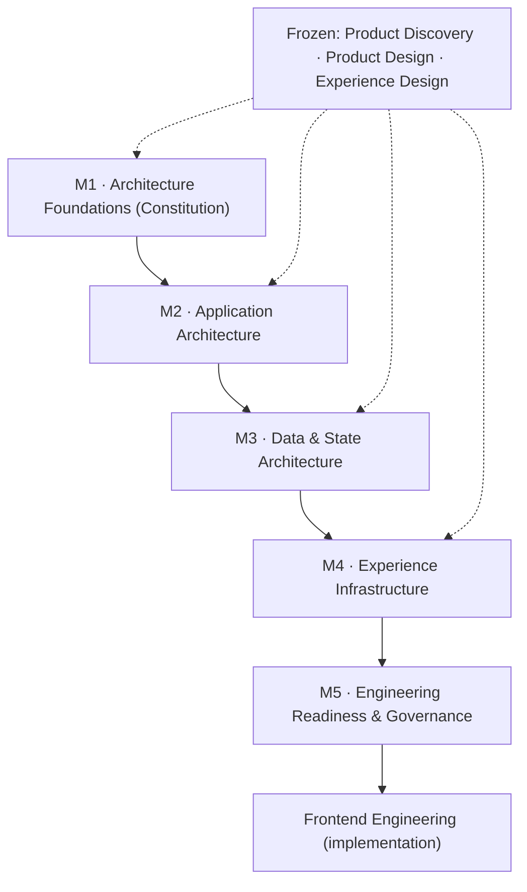

# AlphaScribe vNext — Frontend Architecture Roadmap

| Field | Value |
|-------|-------|
| **Document Status** | ✅ Approved (CTO) — Refinement Pass Applied |
| **Version** | 0.1.1 |
| **Owner** | Frontend Architecture |
| **Approved By** | CTO — architecturally approved |
| **Department / Milestone** | Frontend Architecture · M5 — Engineering Readiness & Governance |
| **Governed by** | [Constitution](01_Frontend_Architecture_Constitution.md) · [05 Engineering Readiness](05_Engineering_Readiness.md) |
| **Last Updated** | 2026-07-19 |

## Revision History

| Version | Date | Author | Status | Description |
|---------|------|--------|--------|-------------|
| 0.1.1 | 2026-07-19 | Frontend Architecture | ✅ Refinement pass | Created in the Milestone 5 CTO refinement pass as the department-level roadmap. Documentation/navigation only; changes no architecture. |

## Purpose

Provide the **department-level roadmap** for Frontend Architecture — how the five milestones fit together,
what each exists to do, who owns it, how they depend on one another, and how the whole progresses into
Frontend Engineering. It is a **navigation and orientation** artifact; it introduces no architecture.

## Scope

**In scope:** the purpose, ownership, dependency relationships, and progression of Milestones 1–5 and their
handoff to Frontend Engineering. **Out of scope:** redefining any milestone's content (frozen), and
implementation.

## Dependencies

The full frozen package — [M1](01_Frontend_Architecture_Constitution.md), [M2](02_Application_Architecture.md),
[M3](03_Data_and_State_Architecture.md), [M4](04_Experience_Infrastructure.md), [M5](05_Engineering_Readiness.md);
[05.13 Traceability Matrix](05.13_Frontend_Architecture_Traceability_Matrix.md) (detailed inheritance),
[05.12 Governance Responsibility Matrix](05.12_Governance_Responsibility_Matrix.md) (ownership detail).

## Architectural Principles

1. **Sequential, dependency-ordered milestones.** Each milestone builds on the frozen ones before it;
   nothing later re-decides something earlier (each is frozen on approval).
2. **Foundations first.** The Constitution governs everything; every later milestone is subordinate to it
   and to the frozen Product/Design/Experience source of truth.
3. **Architecture precedes implementation.** The department concludes at engineering readiness; Frontend
   Engineering consumes the package and makes no foundational architectural decisions.

## The Roadmap

| Milestone | Purpose | Owner | Depends on | Feeds |
|-----------|---------|-------|-----------|-------|
| **M1 — Architecture Foundations** ([Constitution](01_Frontend_Architecture_Constitution.md)) | Fix the non-negotiable principles, constraints, boundaries, rendering philosophy, and governance that govern all frontend work | Frontend Architecture | Frozen Product/Design/Experience | M2–M5 (governs all) |
| **M2 — Application Architecture** ([02](02_Application_Architecture.md)) | Define structure: layers, feature boundaries, routing, layout, components, UI layer, dependency rules | Frontend Architecture | M1 · frozen IA/Nav/Screen Inventory | M3–M5, screens |
| **M3 — Data & State Architecture** ([03](03_Data_and_State_Architecture.md)) | Define data/state ownership, server/client separation, API/validation, caching, auth/authz, forms, flow, recovery, sync, AI streaming, transitions | Frontend Architecture | M1–M2 · frozen States/auth | M4–M5 |
| **M4 — Experience Infrastructure** ([04](04_Experience_Infrastructure.md)) | Define consistent delivery of the frozen experience: design-system integration, tokens, theme, responsive, a11y, motion, states, performance, i18n readiness | Frontend Architecture | M1–M3 · frozen Design/Experience | M5, screens |
| **M5 — Engineering Readiness & Governance** ([05](05_Engineering_Readiness.md)) | Define testing, docs, observability hooks, config, dependency governance, ADRs, governance, conventions, review, and readiness | Frontend Architecture | M1–M4 | Frontend Engineering |
| **→ Frontend Engineering** | Implement the architecture without making foundational architectural decisions | Frontend Engineering | M1–M5 (complete) · design screen artifacts · backend contract | The product |

**Progression:** foundations → structure → data/state → experience delivery → engineering governance →
implementation. Ownership is Frontend Architecture across M1–M5 (with CTO as approver/freeze authority — see
[05.12](05.12_Governance_Responsibility_Matrix.md)); implementation passes to Frontend Engineering within the
frozen architecture ([05.10](05.10_Definition_of_Implementation_Readiness.md)).

## Governance Responsibilities

- **Frontend Architecture** authors and maintains the roadmap and all milestones; changes go through the CR/
  ADR process ([05.7](05.7_Frontend_Governance.md)).
- **CTO** approves and freezes each milestone; the roadmap reflects, but does not decide, those approvals.
- **Frontend Engineering** consumes the completed roadmap; it does not alter it (a needed change is a CR).
Detailed responsibilities: [05.12 Governance Responsibility Matrix](05.12_Governance_Responsibility_Matrix.md).

## Trade-offs

- **Sequential milestones vs. parallel work:** ordering adds up-front sequencing but guarantees each layer
  rests on an approved foundation. Accepted.
- **A separate roadmap doc vs. embedding in the parent:** a dedicated roadmap improves discoverability at a
  small duplication cost (mitigated by linking, not restating). Accepted.

## Risks

- **Roadmap drifting from the milestones.** *Mitigation:* it links to (does not restate) each milestone;
  updated via governance when milestones change.
- **Skipping a dependency** (starting a later concern before its foundation). *Mitigation:* the dependency
  ordering here + the readiness gate ([05.10](05.10_Definition_of_Implementation_Readiness.md)).

## Future Evolution

- New architecture milestones (e.g. a future implementation or release-architecture phase) extend the
  roadmap additively.
- The roadmap updates when the external inputs in [05.10 §AD-3](05.10_Definition_of_Implementation_Readiness.md)
  (design screens, CRs, backend contract) resolve.

## References

[M1](01_Frontend_Architecture_Constitution.md), [M2](02_Application_Architecture.md), [M3](03_Data_and_State_Architecture.md),
[M4](04_Experience_Infrastructure.md), [M5](05_Engineering_Readiness.md); [05.12 Governance Responsibility Matrix](05.12_Governance_Responsibility_Matrix.md),
[05.13 Traceability Matrix](05.13_Frontend_Architecture_Traceability_Matrix.md), [05.14 Evolution Strategy](05.14_Architecture_Evolution_Strategy.md),
[05.10 Implementation Readiness](05.10_Definition_of_Implementation_Readiness.md).

---

*Frontend Architecture · Milestone 5 · Document 05.11 · v0.1.1 (Approved)*
