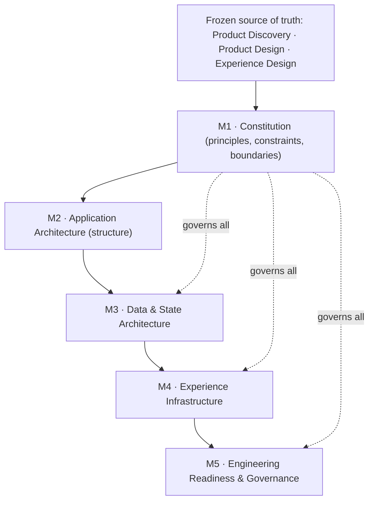

# AlphaScribe vNext — Frontend Architecture Traceability Matrix

| Field | Value |
|-------|-------|
| **Document Status** | ✅ Approved (CTO) — Refinement Pass Applied |
| **Version** | 0.1.1 |
| **Owner** | Frontend Architecture |
| **Approved By** | CTO — architecturally approved |
| **Department / Milestone** | Frontend Architecture · M5 — Engineering Readiness & Governance |
| **Governed by** | [Constitution](01_Frontend_Architecture_Constitution.md) · [05 Engineering Readiness](05_Engineering_Readiness.md) |
| **Last Updated** | 2026-07-19 |

## Revision History

| Version | Date | Author | Status | Description |
|---------|------|--------|--------|-------------|
| 0.1.1 | 2026-07-19 | Frontend Architecture | ✅ Refinement pass | Created in the Milestone 5 CTO refinement pass as the cross-milestone traceability/navigation reference. Documents existing relationships only; redefines no architecture. |

## Purpose

Provide a **traceability matrix** across the Frontend Architecture milestones and up to the frozen
Product/Design/Experience source of truth — showing **dependencies, architectural inheritance, governance
flow, and document relationships** — so an engineer can navigate *what depends on what* and *what governs
what* without reading every document. Navigation only; it redefines no architecture.

## Scope

**In scope:** the cross-milestone dependency/inheritance map, the governance flow, and the upstream
traceability to frozen artifacts. **Out of scope:** redefining any milestone (frozen), and implementation.

## Dependencies

The full package — [M1](01_Frontend_Architecture_Constitution.md)–[M5](05_Engineering_Readiness.md);
[05.11 Roadmap](05.11_Frontend_Architecture_Roadmap.md) (progression view); frozen Product/Design/Experience
source of truth and their [Requirements Traceability Matrix](../governance/Requirements_Traceability_Matrix.md).

## Architectural Principles

1. **Higher governs lower** — the source-of-truth hierarchy ([M1 §5.5](01_Frontend_Architecture_Constitution.md))
   is the backbone of traceability; conflicts resolve upward.
2. **Every decision is traceable** to the frozen intent it serves ([M1 §11](01_Frontend_Architecture_Constitution.md),
   [05.2](05.2_Documentation_Standards.md)); this matrix makes those links navigable.
3. **Inheritance, not repetition** — each milestone inherits principles from above and applies them; it does
   not re-decide them.

## Traceability

### Governance / inheritance flow



### Milestone traceability matrix

| Milestone | Depends on (upstream) | Inherits (key principles) | Feeds (downstream) | Frozen intent it serves |
|-----------|-----------------------|---------------------------|--------------------|--------------------------|
| **M1 Constitution** | Frozen Product/Design/Experience | — (defines the principles) | M2–M5 (governs all) | Trust-first, accessibility (Law 10), never-lose-work (Law 6), premium/calm experience |
| **M2 Application Architecture** | M1 | §4.1 Clean Arch, §4.5 Feature Org, §4.12 Stable Interfaces, §4.14 Decoupling, §7 Rendering | M3–M5, screens | IA domains, Navigation, Screen Inventory, Templates |
| **M3 Data & State** | M1–M2 | §4.9 Types, §4.10 Explicitness, §4.13 Fail Fast, §6 Boundaries, §4.15 Observability | M4–M5 | States catalogue, best-effort data, trust-first, login-wall auth, Law 6 |
| **M4 Experience Infrastructure** | M1–M3 | §4.6 A11y-by-default, §4.7 Performance, §5.3 tokens, §6.5 Design ownership, §14 Motion | M5, screens | Design System, tokens, Responsive, Accessibility, States, Motion (frozen) |
| **M5 Engineering Readiness & Governance** | M1–M4 | §8 Eng Principles, §9 Dependencies, §10 Docs, §11 ADRs, §12 Governance, §13 DoD | Frontend Engineering | Documentation Governance, CR Register, Design QA |

### Governance flow (how change propagates)

```
Frozen upstream change → CR (CTO) → update frozen artifact → cascade to affected FA milestones (CR/ADR)
FA architecture change → CR/ADR (CTO) → update milestone + dependents + version → communicate
Implementation gap/conflict → CR/ADR (never a silent code decision) → resolved upstream
```
Detailed roles: [05.12 Governance Responsibility Matrix](05.12_Governance_Responsibility_Matrix.md); process:
[05.7 Frontend Governance](05.7_Frontend_Governance.md); evolution: [05.14 Evolution Strategy](05.14_Architecture_Evolution_Strategy.md).

## Governance Responsibilities

- **Frontend Architecture** maintains this matrix and keeps it consistent with the milestones it maps;
  updates flow through governance ([05.7](05.7_Frontend_Governance.md)).
- **CTO** approves changes to frozen artifacts that this matrix reflects.
- The matrix is **descriptive** (it maps relationships); it is not itself an authority — the mapped
  documents are.

## Trade-offs

- **A consolidated map vs. per-document dependencies:** the matrix duplicates dependency summaries that live
  in each doc, but a single navigable map is worth the small redundancy (mitigated by links). Accepted.
- **Descriptive vs. authoritative:** keeping the matrix descriptive avoids a second source of truth; it
  always defers to the mapped documents. Accepted.

## Risks

- **Drift from the milestones it maps.** *Mitigation:* descriptive-only + updated via governance when
  milestones change; links (not copies) to authoritative content.
- **Misread as authoritative.** *Mitigation:* Principle 3 + the explicit "descriptive" note.

## Future Evolution

- New milestones/documents are added as rows with their upstream/inherits/feeds mapping.
- If the source-of-truth hierarchy ever changes (via CR to the Constitution), this matrix updates to match.

## References

[M1 §5.5 source-of-truth hierarchy](01_Frontend_Architecture_Constitution.md), [M1–M5](05_Engineering_Readiness.md);
[05.7 Governance](05.7_Frontend_Governance.md), [05.11 Roadmap](05.11_Frontend_Architecture_Roadmap.md),
[05.12 Governance Responsibility Matrix](05.12_Governance_Responsibility_Matrix.md), [05.14 Evolution Strategy](05.14_Architecture_Evolution_Strategy.md);
frozen [Requirements Traceability Matrix](../governance/Requirements_Traceability_Matrix.md).

---

*Frontend Architecture · Milestone 5 · Document 05.13 · v0.1.1 (Approved)*
